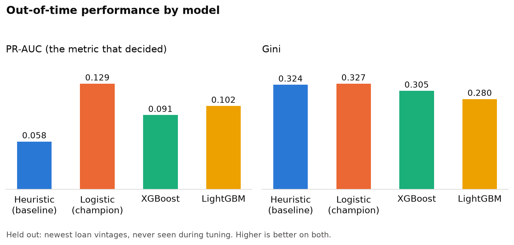
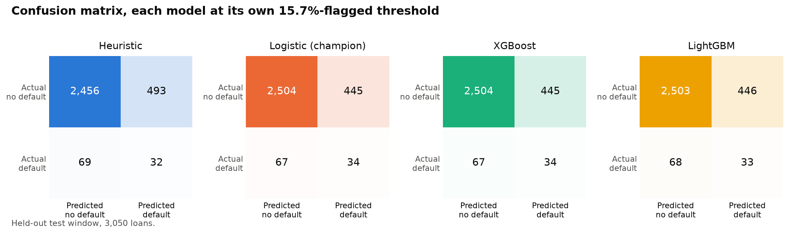
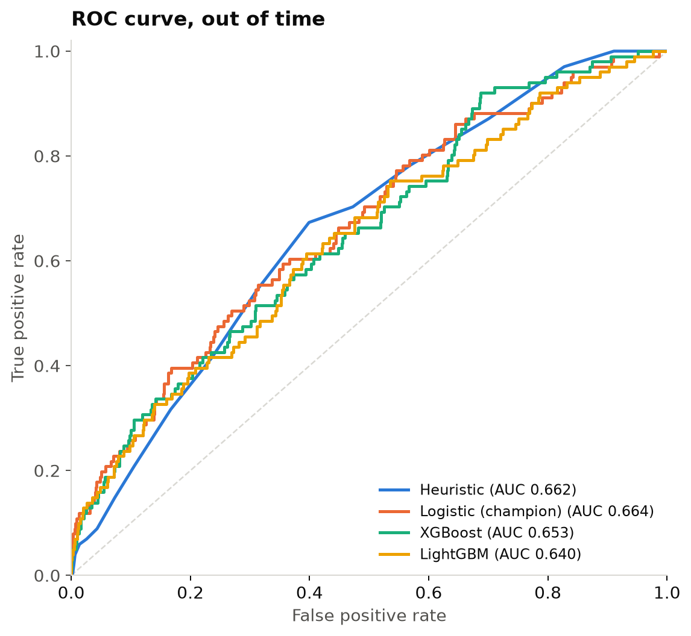
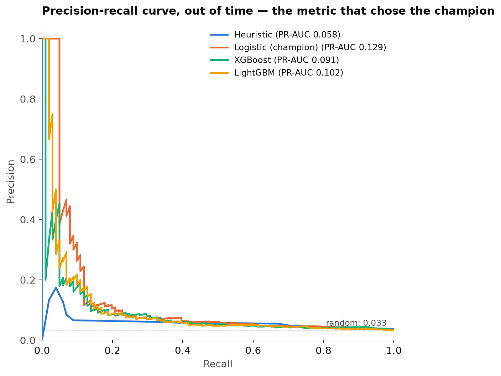
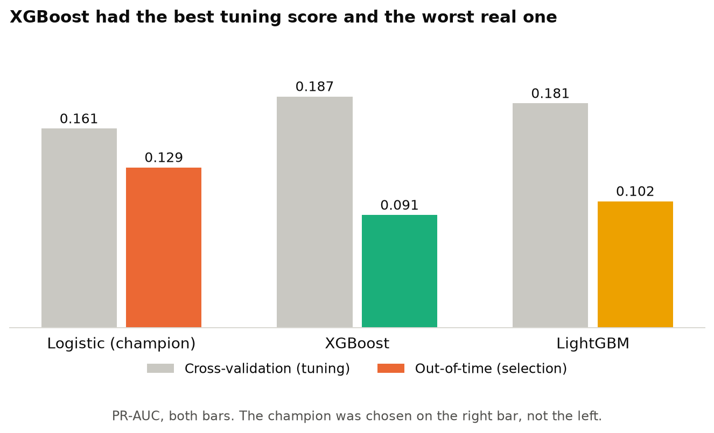
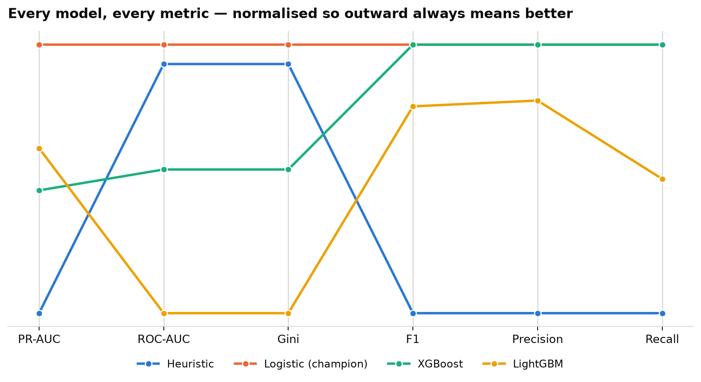

# MLOps — credit scoring

End-to-end MLOps pipeline for loan default risk: raw CSV → feature store → tuned model →
batch API → drift monitoring, for a Colombian bank's loan book.

## Tech stack

| Category | Tool / Library |
| --- | --- |
| **Dependency Management** | `uv` |
| **Configuration** | `Hydra` + `pydantic` |
| **Data Prep & Validation** | `pandas` + `pandera` |
| **Feature Store** | `Feast` |
| **Feature Engineering** | `scikit-learn` |
| **Model Training** | `XGBoost` / `LightGBM` |
| **Hyperparameter Search** | `Optuna` |
| **Experiment Tracking** | `MLflow` |
| **Batch Serving** | `FastAPI` + `Docker` |
| **Model Monitoring** | `Evidently AI` |

## Pipeline


Full detail per stage in `docs/`: [architecture](docs/architecture.md) ·
[feature engineering](docs/feature-engineering.md) · [feature store](docs/feature-store.md) ·
[model training](docs/model-training.md) · [serving](docs/serving.md) ·
[monitoring](docs/monitoring.md).

## How to run it 

```bash
make install
make features feast-apply          # build the feature table + offline store
make train                         # tune, track in MLflow, select a champion (~2.5 min)
make export-champion export-reference
docker compose up --build          # batch API at :8000, monitoring endpoint included
make monitor                       # offline drift + model-quality report
```

And this makes a request to the FastAPI serving endpoint:
```bash
curl -X POST localhost:8000/predict/batch -H 'Content-Type: application/json' -d '{
  "records": [{"application_id":"APP-1","tipo_credito":"9","capital_prestado":4200000,
    "plazo_meses":24,"edad_cliente":23,"tipo_laboral":"Independiente","salario_cliente":1200000,
    "total_otros_prestamos":3500000,"cuota_pactada":390000,"puntaje_datacredito":680,
    "cant_creditosvigentes":7,"huella_consulta":11,"tendencia_ingresos":"Decreciente"}]}'
```

## Results

Out-of-time (train on the oldest 75% of vintages, test on the newest) comparison across all
four candidates — the heuristic baseline, logistic regression, XGBoost and LightGBM:

<p align="center">
  
</p>
<p align="center">
  <sub><b>PR-AUC and Gini per model, out of time</b> — the headline comparison across all four candidates</sub>
</p>

<p align="center">
  
</p>
<p align="center">
  <sub><b>Confusion matrices</b>, each model at its own operating threshold</sub>
</p>

<p align="center">
  
  
</p>
<p align="center">
  <sub><b>ROC curves</b></sub> &nbsp;·&nbsp;
  <sub><b>Precision-recall curves</b> — the metric the selection is actually made on</sub>
</p>

<p align="center">
  
  
</p>
<p align="center">
  <sub><b>CV mean vs. out-of-time PR-AUC</b> — tuning picked a different model than selection did</sub> &nbsp;·&nbsp;
  <sub><b>Six metrics side by side</b>, normalized, parallel coordinates</sub>
</p>

The best model until now is the Optuna-tuned logistic regression — 0.129 PR-AUC and 0.327
Gini out of time, 2.2× the heuristic baseline on PR-AUC (the metric that matters at a 4.75%
default rate). It won on the held-out vintage window, not cross-validation: XGBoost scored
best in CV (0.187) but worst out of time (0.091), a reminder that this book has real vintage
structure a shuffled fold can't see.

Full comparison and the reasoning behind the selection protocol in
[`docs/model-training.md`](docs/model-training.md).
