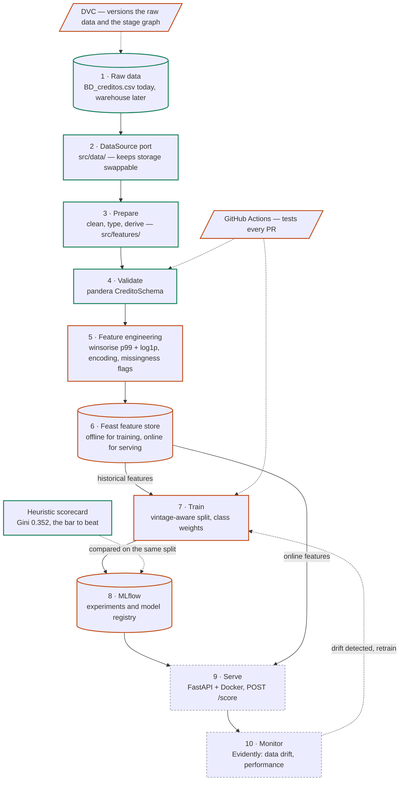

# Architecture

How the end-to-end pipeline fits together, and which tools were chosen over which
alternatives. Decisions are recorded with their reasoning, including the ones that
removed a tool from the stack.

## The pipeline

Solid arrows carry data. Dashed arrows carry control: versioning, CI triggers, and the
drift signal that closes the loop back to training.

Green outline is shipped, orange is next in dependency order, dashed grey is later.

| # | Stage | Tool | Where | Status |
| --- | --- | --- | --- | --- |
| 1 | Storage | CSV, later a warehouse | `data/raw/` | shipped |
| 2 | Access | `DataSource` port + adapter | `src/data/` | shipped |
| 3 | Prepare | pandas | `src/features/`, `src/pipelines/prepare.py` | shipped |
| 4 | Validate | pandera | `src/data/schema.py` | shipped |
| 5 | Feature engineering | pandas | `src/features/` | next |
| 6 | Feature store | Feast | — | next |
| 7 | Train | scikit-learn | `src/models/` | next |
| 8 | Track + register | MLflow | — | next |
| 9 | Serve | FastAPI + Docker | `src/deployment/`, `docker/` | later |
| 10 | Monitor | Evidently | `src/monitoring/` | later |
| — | Versioning | DVC | — | next |
| — | CI | GitHub Actions | `.github/workflows/` | shipped |
| — | Baseline | heuristic scorecard | `src/models/` | shipped |

## Storage stays swappable

`src/pipelines/prepare.py` is the single seam every later stage attaches to. It accepts
anything with `read() -> DataFrame`, so moving from the CSV to a cloud database is one new
adapter beside `src/data/csv_source.py`, one line in the registry in `src/data/factory.py`,
and a change to `config/config.yaml`. No other module changes.

This is also what makes the DVC decision below cheap to reverse.

## Stack decisions

### pandera, not Great Expectations

Both validate dataframes, but they answer different questions, and in this project the
second question already has a better owner.

pandera is a typed schema contract that lives in code next to what it describes: cheap to
run, fails fast, versioned with the code, tested by pytest. Great Expectations is a data
quality platform — expectation store, checkpoints, Data Docs, profilers — whose value is
organizational: a browsable quality record for non-engineers, and profiling to *discover*
rules on data nobody has studied.

That discovery value is zero here. The rules were derived by hand in section 2.7 of the
EDA and are already encoded as `CreditoSchema`. Adopting GX would mean re-expressing proven
Python in JSON config that drifts from the code.

The decisive point is that GX is squeezed from both sides. Split the work by role and
pandera owns *"is this row valid?"* while *"does this batch look like previous batches?"*
is drift detection — which is Evidently's job, and Evidently does it better. Nothing unique
is left for GX to own, so it is not worth a heavy dependency and an API that broke across
0.15, 0.18 and 1.0.

**If GX is adopted anyway, never run both on the same rules.** pandera is the gate inside
`prepare()` and fails the run; GX is a non-gating report in CI over the raw input — row
count in range, default rate plausible, per-column null rate near what the EDA measured
(`promedio_ingresos_datacredito` at ~27 %; alert if it reaches 60 %).

### MLflow, not Weights & Biases

Same product category. MLflow wins because the model registry is needed too, and it is
self-hosted alongside everything else. W&B's real advantages — large hyperparameter sweeps,
deep-learning artifact lineage, hosted team collaboration — do not apply to a tabular credit
model with a handful of runs. Running both means double logging and two sources of truth.

### DVC now, thin, and retired on migration

DVC and MLflow are **not** redundant; they version different things.

| | DVC | MLflow |
| --- | --- | --- |
| Datasets | yes, content-addressed and git-linked | no, only as unversioned artifact blobs |
| Pipeline DAG and caching | yes (`dvc.yaml`, `dvc repro`) | no |
| Params and metrics per run | thin (`dvc exp`) | yes, this is the core |
| Model binaries and registry | no | yes |

The only real collision is `dvc exp` against MLflow runs, and the answer is simply not to
use `dvc exp`.

Today DVC earns its place: there is a CSV on disk that git cannot hold well and that must be
pinned to the commit that produced a result. There is no alternative.

**On a lakehouse, its data-versioning job disappears.** Delta, Iceberg, BigQuery and
Snowflake all provide time travel at the storage layer, so every consumer gets it rather
than only those who remembered to `dvc pull`. DVC's content-addressing exists to bolt that
onto a filesystem that lacks it; running it over warehouse data would mean exporting tables
to files in order to hash them, which is worse in every dimension. For tabular data this is
not a close call.

Two things a lakehouse does not replace, and where each goes instead:

- **Pipeline definition and caching.** dbt covers it for SQL; Dagster, Prefect or the cloud's
  managed orchestrator cover it for Python. This job migrates, it does not vanish.
- **The git-commit to data-version link.** Replaced by recording the snapshot as a run
  parameter — `mlflow.log_param("delta_version", v)`. Arguably better, since reproducibility
  then attaches to the run rather than to a branch.

**So: adopt DVC, but scope it to be cheap to remove.** Use it for data versioning and the
`dvc.yaml` stage graph only. Do not use `dvc exp`, `dvc metrics` or `dvc plots` — that is the
MLflow-overlapping surface, and the part that would make DVC hard to retire. Data access
stays behind the `DataSource` port: DVC versions the file the CSV adapter reads, and never
becomes an API the pipeline calls.

### No orchestrator yet, and probably not Airflow when there is one

The test for needing an orchestrator is whether any of these is true: work must run on a
schedule with no human, steps span several systems, backfills over historical partitions are
needed, production requires retry and alerting semantics, or pipelines share dependencies.

None currently hold. The pipeline is one Python process, a few seconds end to end, on one
machine, over a 1.4 MB file. `dvc repro` already provides a cached DAG, and GitHub Actions
covers triggered and scheduled runs. Together that is real orchestration at no
infrastructure cost.

The need appears at stages 6 and 10: scheduled Feast materialization, and retraining
triggered by the drift signal. At that point the choice should be re-evaluated rather than
defaulted to Airflow:

- On a managed lakehouse the orchestrator is already present — Databricks Workflows, Vertex
  AI Pipelines, SageMaker Pipelines — with lineage included and no infrastructure to run.
- For a standalone Python orchestrator, **Dagster** fits ML better. It is asset-oriented,
  modelling datasets and models as assets with lineage, which maps onto a feature store plus
  a model registry far more naturally than Airflow's task-oriented DAGs. Prefect is the
  lighter middle option.
- Airflow's strengths — a large operator ecosystem, mature scheduling semantics, proven at
  enterprise scale — pay off across hundreds of heterogeneous jobs. That is not this project.

### Hydra is declared but unused — decide before training

`hydra-core` is in `pyproject.toml`, but configuration is currently plain YAML parsed into
pydantic models in `src/config.py`, which is enough for a single source and a single
threshold.

Hydra earns its place at stage 7, where config composition (swapping model or split
definitions without editing files) and `--multirun` sweeps are genuinely useful. Either
adopt it there or drop the dependency; leaving it declared and unused is the worst of both.

### Kept without contest

- **Feast** — a distinct job nothing else covers: the same feature definitions serving both
  training and inference, with point-in-time correctness.
- **Evidently** — owns drift and production performance, including the distribution checks
  GX would otherwise have claimed.
- **FastAPI + Docker** — the serving surface.
- **pydantic** — typed configuration, and request validation once the API exists.

## Summary

| Keep | Dropped | Reason |
| --- | --- | --- |
| pandera | Great Expectations | Validity is pandera's, distribution is Evidently's; no territory left |
| MLflow | Weights & Biases | Same category; MLflow also has the registry |
| DVC (thin) | — | Earns its place on a CSV; absorbed by lakehouse time travel later |
| `dvc repro` + Actions | Airflow | No scheduling, multi-system or backfill need yet |
| Evidently, Feast, FastAPI, Docker, pydantic | — | Each owns a job nothing else does |
| — | Hydra (undecided) | Adopt at stage 7 or drop; currently declared and unused |

## Answers from the business

Recorded 2026-09-16. These unblocked stage 5.

- **The DataCrédito block is an origination-time pull**, not an extract-time snapshot. So
  `puntaje_datacredito`, `huella_consulta`, `promedio_ingresos_datacredito`,
  `tendencia_ingresos` and `saldo_mora` are all decision-time features and the heuristic's
  Gini 0.352 stands. `saldo_mora` and `tiene_mora_bureau` have come off the withheld list.
  The data agreed before the business did: inquiries show no accumulation with loan age
  (corr −0.015, flat across 15 vintages), which an extract-time snapshot would not produce.
- **Bureau balances are in thousands of COP.** `clean()` scales them to pesos, which moves the
  median `saldo_total` from an implausible 16 178 COP to 16 178 000 — 5.35× median salary, the
  right order of magnitude for total bureau debt. `tiene_mora_bureau` thresholds at zero and is
  unit-invariant, so no score moved.
- **A derived flag must distinguish "no" from "unknown".** `cuota_supera_salario` and
  `tiene_mora_bureau` are nullable now: 46 applicants whose salary could not be verified were
  being recorded as "instalment does not exceed salary", and 156 with no bureau balance as
  "no arrears". `falta_*` indicators are emitted for the eight source columns whose absence
  carries signal — every one lifts the default rate when missing, from 1.18× to 1.54× over the
  4.75 % base.
- **A client identifier exists and will be added to the extract.** It is not in
  `data/raw/BD_creditos.csv` yet: none of the 23 columns is unique per row. Feast needs it as
  the entity join key, and it also unlocks repeat-borrower history, so stage 6 waits on the
  re-export.

## Still open

- Is `saldo_mora` observed at the same moment as the rest of the bureau block? The business
  confirmed the block as a whole, but arrears drift weakly with loan age (corr +0.051, on only
  55 loans), which is the one signal inconsistent with an origination-time pull. Worth a second
  look once there is more data.
